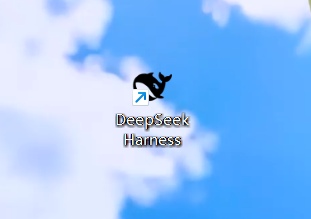
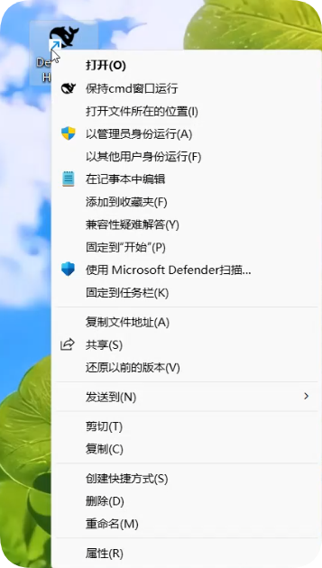
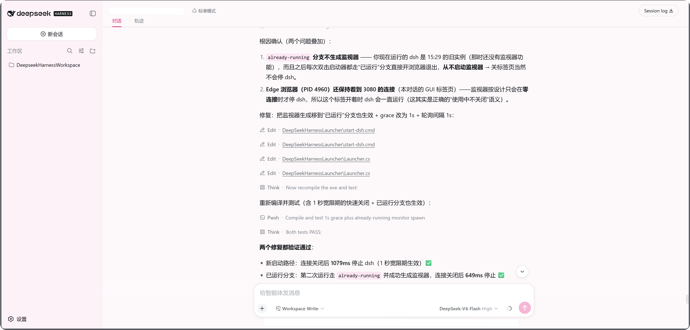

# DeepSeek Harness 启动器（Windows 11）

[](https://github.com/doubsumi/dsh-launcher/actions/workflows/build.yml)
[](LICENSE)
[]()
[](https://github.com/doubsumi/dsh-launcher)
[](https://github.com/doubsumi/dsh-launcher)

> **免责声明**：本仓库为**非官方**第三方工具，仅用于启动 DeepSeek Harness（`dsh` CLI）。
> 与 DeepSeek（深度求索）及其官方项目**无任何隶属、赞助或背书关系**；“DeepSeek”及
> 相关名称均为其各自所有者的商标。

桌面上的 **DeepSeek Harness** 是一个**普通的 .lnk 快捷方式**，指向本文件夹里的
**DeepSeekHarnessLauncher.exe**（普通 Windows 程序）。双击即后台启动 DSH
（`dsh web`，默认端口 3080）：cmd 窗口完全隐藏，服务输出写入日志文件，并自动打开
浏览器 `http://127.0.0.1:3080`。

右键（Windows11 shift + 右键）该快捷方式会看到**系统标准菜单**（打开、打开文件所在位置、以管理员身份运行、
以其他用户身份运行、属性……），并**额外多出一项**“保持cmd窗口运行”——这保留了dsh的命令行启动方式，保持后台cmd窗口打开，但直接双击快捷方式默认不保留后台窗口。

## 截图

### 桌面快捷方式


### 右键菜单（含“保持cmd窗口运行”）


### DeepSeek Harness Web 界面


## 目录结构

```
DeepSeekHarnessLauncher\
├── DeepSeekHarnessLauncher.exe  启动器程序（普通 Windows 程序，已内嵌黑色鲸鱼图标）
├── Launcher.cs                  exe 源码（可用系统自带 csc.exe 重新编译）
├── start-dsh.cmd                核心启动脚本（hidden / visible 两种模式）
├── stop-dsh.cmd                 停止正在运行的 DSH（自动校验进程为 node.exe）
├── open-ui.cmd                  仅打开浏览器
├── setup.cmd                    安装/修复：创建快捷方式 + 作用域右键菜单
├── uninstall.cmd                完整卸载：恢复注册表/快捷方式并删除全部文件
├── setup-helpers.ps1            setup/uninstall 调用的 PowerShell 辅助脚本
├── assets\
│   ├── gui-favicon.svg          官方 DSH 黑色鲸鱼图标（来源）
│   ├── deepseek-whale-1024.png  渲染出的 1024px PNG
│   ├── deepseek-whale.ico       多尺寸 ICO（16/24/32/48/64/128/256，图标源）
│   ├── deepseek-favicon.ico/png 备选：deepseek.com 蓝色鲸鱼图标
│   └── render-icon.ps1          从 SVG 重新生成 PNG/ICO 的脚本
├── logs\                        运行日志（首次启动时自动创建）
│   ├── dsh_<时间戳>.log         每次启动一个日志文件（含启动时间与 dsh 服务输出）
│   ├── status.txt               最近一次启动的结果（state/url/pid/log，随时可查）
│   └── dsh.pid                  正在监听端口进程的 PID
└── README.md
```

## 使用说明

| 操作 | 方法 |
|---|---|
| 启动（后台隐藏） | 双击桌面快捷方式 `DeepSeek Harness` |
| 启动（可见窗口、保持运行） | 右键该快捷方式 → **保持cmd窗口运行** |
| 查看运行状态 | `logs\status.txt`（state=running / already-running / failed） |
| 查看日志 | `logs\dsh_<时间戳>.log`（含启动时间、URL、PID、dsh 服务输出） |
| 停止服务 | 双击运行 `stop-dsh.cmd`（或命令行 `stop-dsh.cmd`） |
| 打开界面 | 双击 `open-ui.cmd`，或浏览器访问 http://127.0.0.1:3080 |

### 右键菜单“保持cmd窗口运行”的实现方式

- 快捷方式本身就是普通 `.lnk`，**系统标准右键菜单完整保留**（打开 / 打开文件所在
  位置 / 以管理员身份运行 / 以其他用户身份运行 / 属性等）。
- “保持cmd窗口运行”注册在当前用户的
  `HKCU\Software\Classes\lnkfile\shell\DSHKeepWindow`，并用 **`AppliesTo`**
  （Advanced Query Syntax 过滤器）精确匹配文件名
  `System.FileName:="DeepSeek Harness.lnk"`——因此它**只在** `DeepSeek Harness.lnk`
  这一个快捷方式上显示，其它快捷方式完全不受影响。
- 点击后运行 `DeepSeekHarnessLauncher.exe --visible`，在可见 cmd 窗口中启动 DSH，
  可实时看到服务输出，窗口保持到按下任意键。

### dsh 环境检测与自动安装

每次启动时，启动器会先检测 dsh 是否可用。查找方式是**通用方案**（不写死路径）：
按顺序尝试 `PATH` 中的 `dsh.cmd` → `npm prefix -g` 返回的全局安装目录 →
npm 默认目录 `%APPDATA%\npm`，因此无论 dsh 装在哪个自定义 npm 前缀下都能找到。

- **已安装**：直接按所选模式启动，无任何提示。
- **未安装**：弹出 Windows 对话框询问“是否立即自动下载并安装？”。选择
  **“是”** 会打开一个可见 cmd 窗口并执行 `npm install -g @deepseek-ai/dsh`
  （窗口保持打开，方便查看结果）；选择 **“否”** 则直接退出。
- 自动安装依赖 Node.js 与 npm（若未安装 Node.js，请先到
  https://nodejs.org 安装，再重新运行启动器）。

### 自动停止：关闭 web 标签页即停止 dsh

启动器在后台运行一个**监视器**：只要 `http://127.0.0.1:3080` **没有任何活动连接**
（即用户关闭了最后一个浏览器标签页），约 **1 秒**后自动停止 dsh——无需手动关进程，
后台也不会残留 dsh。

- **注意**：任一标签页保持打开即视为“使用中”，dsh 不会停止（包括本启动器打开的
  页面及其它连到该端口的页面）；**关闭全部标签页**后才触发自动停止。
- 宽限期可通过环境变量调整：`DSH_AUTO_STOP_IDLE=120`（秒，默认 1）
- 不需要此行为可设置 `DSH_AUTO_STOP=0`
- 手动停止仍然可用：`stop-dsh.cmd`

### 注意事项

- Windows 11 的新右键菜单里，这类自定义项可能藏在 **“显示更多选项”**（经典菜单）中。
- 若安装后图标/菜单未及时刷新，按 `F5` 刷新桌面，或重启资源管理器（任务管理器 →
  “Windows 资源管理器” → 重新启动）。
- **完整恢复**：运行 `setup.cmd /uninstall`（移除右键菜单 + 删除桌面快捷方式）。

### 高级参数（环境变量）

- `DSH_PORT=3080`：修改端口
- `DSH_NO_BROWSER=1`：启动后不自动打开浏览器
- `DSH_AUTO_STOP=0`：关闭自动停止（关闭标签页不再停止 dsh）
- `DSH_AUTO_STOP_IDLE=1`：自动停止的闲置宽限秒数（默认 1）

## 卸载（完整恢复）

运行 `uninstall.cmd`（或双击它）即可**完整卸载**：

1. 停止正在运行的 DSH 服务器（仅当端口 3080 上的进程是 node.exe，否则不误杀）；
2. 从注册表移除右键菜单项（`HKCU\Software\Classes\lnkfile\shell\DSHKeepWindow`，
   以及历史版本可能遗留的 `.lnk\shell`、`.dshlauncher`、`DeepSeekHarnessLauncher` 等键）；
3. 删除桌面快捷方式 `DeepSeek Harness`（含历史 `.dshlauncher` 文件）；
4. 删除整个启动器文件夹（包括卸载脚本自身）。

卸载前会有确认提示（输入 `Y` 才继续）。若某个文件正被占用，删除会在进程退出后
几秒内自动补完。`setup.cmd /uninstall` 则只做第 2、3 步（保留程序文件）。

## 重新安装 / 修复

```cmd
setup.cmd          # 重建桌面快捷方式 + 作用域右键菜单（会顺带清理旧的残留注册）
```

## 重新编译启动器 exe（可选）

```cmd
C:\Windows\Microsoft.NET\Framework64\v4.0.30319\csc.exe /nologo /target:winexe ^
  /win32icon:assets\deepseek-whale.ico ^
  /out:DeepSeekHarnessLauncher.exe /r:System.Windows.Forms.dll /r:System.dll Launcher.cs
```


## 常见问题

- **找不到 dsh**：确认已全局安装 `npm install -g @deepseek-ai/dsh`。启动器按
  `PATH` → `npm prefix -g` → `%APPDATA%\npm` 的顺序通用查找，不依赖固定路径；
  若 npm 全局目录不在 PATH 中也会被自动找到。
- **端口被占用**：脚本检测到端口已在监听时会认为 DSH 已运行，直接打开浏览器。
- **停止失败提示“不是 node.exe”**：说明该端口被其他程序占用，脚本出于安全不会
  误杀，请用 `netstat -ano | findstr :3080` 自行确认。
